# Ferramenta de Anotação TFC

Uma aplicação full-stack para gestão e anotação de projetos de chat disentanglement, com cálculo automático de métricas de Inter-Annotator Agreement (IAA).

## 📋 Índice

1. [Configuração Rápida](#configuração-rápida)
2. [Deployment Local vs Remoto](#deployment-local-vs-remoto)
3. [Configuração para Acesso Remoto](#configuração-para-acesso-remoto)
4. [Testing com Dados Reais](#testing-com-dados-reais)
5. [Conversion Tools - Importação Excel](#conversion-tools---importação-excel)
6. [Credenciais e Acesso](#credenciais-e-acesso)
7. [Estrutura do Projeto](#estrutura-do-projeto)
8. [Troubleshooting](#troubleshooting)

---

## 🚀 Configuração Rápida

### Pré-requisitos
- **Docker** e **Docker Compose**
- **Python 3.8+** (para conversion tools)

### Setup em 3 passos

#### 1. Clonar e configurar
```bash
git clone <repositório>
cd ann-tfc
cp .env.example .env
```

#### 2. Configurar IP (se necessário)
```bash
# Para acesso local apenas (default):
# Deixar .env como está (SERVER_IP=localhost)

# Para acesso remoto, editar .env:
echo "SERVER_IP=192.168.1.100" > .env  # Substituir pelo IP real
```

#### 3. Executar
```bash
docker compose up --build -d
```

**✅ Pronto!** 
- **Frontend**: http://localhost:3721 (ou http://IP_SERVIDOR:3721)
- **Backend API**: http://localhost:8000 (ou http://IP_SERVIDOR:8000)
- **Login**: `admin@example.com` / `admin`

---

## 🌐 Deployment Local vs Remoto

### Deployment Local (mesma máquina)

Para usar apenas na máquina onde está instalado:

```bash
# Configuração default
docker compose up --build -d

# Acesso em: http://localhost:3721
```

### Deployment Remoto (acesso de outras máquinas)

Para permitir acesso de outras máquinas na rede:

#### 1. Descobrir IP da máquina servidor
```bash
# Linux/Mac
ip addr show | grep "inet " | grep -v "127.0.0.1"
# ou
hostname -I

# Windows
ipconfig

# Exemplo output: 192.168.1.100
```

#### 2. Configurar o IP
```bash
echo "SERVER_IP=192.168.1.100" > .env  # Usar IP real
```

#### 3. Deploy com configuração remota
   ```bash
   docker compose up --build -d
   ```

#### 4. Verificar acesso
   ```bash
# Testar API
curl http://192.168.1.100:8000/

# Os utilizadores acedem via:
# http://192.168.1.100:3721
```

---

## ⚙️ Configuração para Acesso Remoto

### Cenários Comuns

| Cenário | Configuração necessária | Acesso |
|---------|------------------------|--------|
| **Desenvolvimento local** | `SERVER_IP=localhost` | http://localhost:3721 |
| **Server LAN** | `SERVER_IP=192.168.1.100` | http://192.168.1.100:3721 |
| **Server WiFi** | `SERVER_IP=10.0.0.50` | http://10.0.0.50:3721 |
| **VPN/Remote** | `SERVER_IP=172.16.0.10` | http://172.16.0.10:3721 |

### Frontend Configuration

Se não usar Docker Compose, configurar manualmente o frontend:

```bash
cd annotation_ui
cp .env.example .env

# Editar .env:
echo "REACT_APP_API_URL=http://192.168.1.100:8000" > .env
```

### Verificação de Conectividade

   ```bash
# Backend funcionando
curl http://IP_SERVIDOR:8000/
# Deve retornar: {"name":"Annotation Backend","version":"1.0.0",...}

# Frontend funcionando  
curl http://IP_SERVIDOR:3721/
# Deve retornar HTML da aplicação React

# CORS configurado correctamente
curl -H "Origin: http://IP_SERVIDOR:3721" http://IP_SERVIDOR:8000/
# Deve incluir headers Access-Control-Allow-Origin
```

### Como Funciona a Configuração (Fluxo Técnico)


### Configuração Detalhada: O que Acontece Exactamente

#### 🎯 **Conceito Chave: Uma Variável Controla Tudo**

A configuração inteira é controlada por **uma única variável**: `SERVER_IP`

**Quando mudas `SERVER_IP=192.168.1.100`**:
- ✅ Backend automaticamente permite CORS de `http://192.168.1.100:3721`
- ✅ Frontend automaticamente conecta à API em `http://192.168.1.100:8000`
- ✅ Docker Compose configura tudo automaticamente
- ✅ Não precisas editar código nenhum

#### 📋 **Cenários de Deployment Explicados**

| Cenário | SERVER_IP | O que acontece | Quem pode aceder |
|---------|-----------|---------------|------------------|
| **Local** | `localhost` | CORS: `localhost:3721`<br/>API: `localhost:8000` | Só a máquina local |
| **LAN** | `192.168.1.100` | CORS: `localhost:3721` + `192.168.1.100:3721`<br/>API: `192.168.1.100:8000` | Qualquer máquina na rede |
| **WiFi** | `10.0.0.50` | CORS: `localhost:3721` + `10.0.0.50:3721`<br/>API: `10.0.0.50:8000` | Qualquer máquina no WiFi |

#### 🔧 **Fluxo de Configuração Passo-a-Passo**

**1. Ficheiro de Template (`.env.example`)**
```bash
# Template com todas as opções explicadas
SERVER_IP=localhost  # ← Só esta linha muda para deployment remoto
FRONTEND_PORT=3721
BACKEND_PORT=8000
# ... mais configurações
```

**2. Criar Configuração Personalizada**
```bash
cp .env.example .env
# Editar apenas a linha que interessa:
echo "SERVER_IP=192.168.1.100" >> .env
```

**3. Docker Compose Lê a Configuração**
```yaml
# docker-compose.yml usa variáveis do .env automaticamente
environment:
  - SERVER_IP=${SERVER_IP:-localhost}  # ← Lê do .env
  - REACT_APP_API_URL=http://${SERVER_IP:-localhost}:8000
```

**4. Backend Calcula CORS Dinamicamente**
```python
# annotation-backend/app/config.py
@property
def dynamic_cors_origins(self) -> List[str]:
    origins = ["http://localhost:3721", "http://127.0.0.1:3721"]
    if self.SERVER_IP != "localhost":
        origins.append(f"http://{self.SERVER_IP}:{self.FRONTEND_PORT}")
    return origins
```

**5. Resultado Final**
- Backend aceita pedidos de todas as origens necessárias
- Frontend conecta ao backend correto automaticamente
- Utilizadores acedem via IP correto

#### 💡 **Porquê Esta Abordagem é Genial**

**Antes** (problemático):
```bash
# Tinhas que editar múltiplos ficheiros manualmente:
# 1. annotation-backend/app/config.py - adicionar CORS
# 2. annotation-backend/app/main.py - configurar middleware  
# 3. annotation_ui/.env - configurar API URL
# 4. docker-compose.yml - ajustar environment variables
# = 4 ficheiros diferentes, propenso a erros
```

**Agora** (simples):
```bash
# Uma linha resolve tudo:
echo "SERVER_IP=192.168.1.100" > .env
docker compose up -d
# = 1 ficheiro, impossível errar
```

#### 🎮 **Exemplos Práticos Detalhados**

**Exemplo 1: Development Team (cada um na sua máquina)**
```bash
# Developer A (local)
# Não faz nada, usa defaults
docker compose up -d
# Acesso: http://localhost:3721

# Developer B (quer testar remotamente)
echo "SERVER_IP=$(hostname -I | awk '{print $1}')" > .env
docker compose up -d
# Acesso: http://[seu-ip]:3721
```

**Exemplo 2: Servidor de Testing**
```bash
# Admin instala no servidor
echo "SERVER_IP=192.168.1.100" > .env
docker compose up -d

# Team pode aceder de qualquer máquina:
# http://192.168.1.100:3721
# Login: admin@example.com / admin
```

**Exemplo 3: Demo para Cliente**
```bash
# Laptop do vendedor
echo "SERVER_IP=$(ifconfig | grep -A1 wlan0 | grep inet | awk '{print $2}')" > .env
docker compose up -d

# Cliente vê demo no próprio dispositivo:
# http://[ip-do-laptop]:3721
```

---

## 🧪 Testing com Dados Reais

### Workflow Completo para Testing

#### 1. Preparar dados anotados
- Ficheiros **Excel (.xlsx)** com anotações reais
- Múltiplos anotadores por ficheiro
- Dados prontos para cálculo de IAA

#### 2. Usar Conversion Tools
```bash
cd conversion_tools
pip install -r requirements.txt
python import_excel.py
```

#### 3. Verificar importação
- Login como admin: `admin@example.com` / `admin`
- Verificar projetos e chat rooms criados
- Verificar utilizadores importados

#### 4. Testar como anotador
- Login com utilizador importado: `[nome]@research.pt` / `password`
- Verificar anotações carregadas
- Testar interface de anotação

#### 5. Calcular métricas IAA
- Aceder secção de análise
- Ver métricas calculadas automaticamente
- Exportar resultados (se disponível)

### Localização de Ficheiros de Teste

Colocar ficheiros Excel em:
```
uploads/Archive/          # Recomendado
uploads/                  # Alternativo
conversion_tools/excel_files/  # Para testing
```

### Estrutura Esperada dos Ficheiros Excel

```
exemplo_chat_anotado.xlsx
├── thread_joao     # Anotações do João
├── thread_maria    # Anotações da Maria
└── thread_pedro    # Anotações do Pedro

Colunas obrigatórias:
- user_id: ID do utilizador
- turn_id: ID único da mensagem  
- turn_text: Texto da mensagem
- reply_to_turn: Referência a mensagem anterior
- thread: ID do thread (diferente por anotador)
```

---

## 📊 Conversion Tools - Importação Excel

### Setup Rápido

```bash
cd conversion_tools
pip install -r requirements.txt
cp config.yaml.example config.yaml
```

### Configuração da API

Editar `config.yaml`:
```yaml
api:
  base_url: "http://localhost:8000"  # Ou IP do servidor
  admin_email: "admin@example.com"
  admin_password: "admin"

import:
  email_domain: "research.pt"
  default_user_password: "password"  # Simplificado para testing
```

### Execução

```bash
python import_excel.py
```

### O que acontece na importação

1. **🔍 Detecção** de ficheiros Excel automaticamente
2. **👀 Preview** dos dados (anotadores, mensagens, anotações)  
3. **📋 Seleção** de projeto (existente ou criar novo)
4. **⚡ Importação completa**:
   - Criação de chat rooms
   - Criação de utilizadores com emails limpos
   - Importação de mensagens
   - Importação de anotações por utilizador
5. **📊 Relatório** detalhado dos resultados

### Resultados da Importação

**Utilizadores criados**:
- Emails simplificados: `joao@research.pt`, `maria@research.pt`
- Password única: `password`

**Dados importados**:
- Chat rooms com mensagens completas
- Anotações associadas por utilizador
- Prontos para cálculo de métricas IAA

---

## 🔑 Credenciais e Acesso

### Utilizador Administrador (pré-configurado)
- **Email**: `admin@example.com`
- **Password**: `admin`
- **Acesso**: Gestão completa, importação, métricas

### Utilizadores Importados (automático via conversion tools)
- **Formato**: `[nome_anotador]@research.pt`
- **Password**: `password`
- **Acesso**: Interface de anotação, visualização próprias anotações

**Exemplos após importação Excel**:
- `joao@research.pt` / `password`
- `maria@research.pt` / `password`
- `pedro@research.pt` / `password`

---

## 📁 Estrutura do Projeto

```
ann-tfc/
├── annotation-backend/      # API FastAPI
│   ├── app/                # Código da aplicação
│   │   ├── api/           # Routers da API
│   │   ├── models.py      # Modelos SQLAlchemy
│   │   ├── schemas.py     # Schemas Pydantic
│   │   └── config.py      # Configurações (CORS dinâmico)
│   └── Dockerfile         # Container backend
│
├── annotation_ui/          # Frontend React
│   ├── src/               # Código fonte
│   │   ├── components/    # Componentes React
│   │   └── utils/api.js   # Cliente API
│   ├── .env.example       # Template configuração frontend
│   └── Dockerfile         # Container frontend
│
├── conversion_tools/       # Ferramentas importação
│   ├── excel_import/      # Módulos importação Excel
│   ├── import_excel.py    # Script principal
│   └── config.yaml        # Configuração API
│
├── docker-compose.yml      # Orquestração containers (usa .env)
├── .env.example           # 🎯 TEMPLATE CONFIGURAÇÃO GLOBAL
└── README.md              # Este ficheiro
```

### 🗂️ **Hierarquia de Configuração (Ordem de Prioridade)**

```mermaid
graph LR
    A["1. Variáveis Ambiente<br/>export SERVER_IP=..."] --> B["2. Ficheiro .env<br/>SERVER_IP=..."]
    B --> C["3. docker-compose.yml<br/>${SERVER_IP:-localhost}"]
    C --> D["4. Defaults Hardcoded<br/>localhost"]
    
    style A fill:#ff6b6b
    style B fill:#4ecdc4
    style C fill:#45b7d1
    style D fill:#96ceb4
```



**Como funciona a prioridade**:
1. **🔴 Variáveis de ambiente** (mais alta prioridade)
   ```bash
   SERVER_IP=10.0.0.50 docker compose up -d
   ```

2. **🟢 Ficheiro `.env`** (prioridade normal - **recomendado**)
   ```bash
   # .env file
   SERVER_IP=192.168.1.100
   ```

3. **🔵 docker-compose.yml defaults** (fallback)
   ```yaml
   ${SERVER_IP:-localhost}  # usa "localhost" se não definido
   ```

4. **🟡 Hardcoded defaults** (última opção)
   ```python
   # config.py
   SERVER_IP: str = "localhost"
   ```

### 📂 **Ficheiros de Configuração Explicados**

#### `.env.example` - Template Principal
```bash
# Ficheiro que serves como template e documentação
# Contém TODAS as opções disponíveis com explicações
# É commitado no git para outros developers verem
```

#### `.env` - Configuração Real (criado por ti)
```bash
# Ficheiro que TU crias baseado no .env.example
# Contém as configurações REAIS do teu deployment
# NÃO é commitado no git (dados sensíveis)
```

#### `annotation_ui/.env.example` - Template Frontend
```bash
# Template específico para o frontend
# Útil se quiseres correr o frontend separadamente
# Explica como configurar REACT_APP_API_URL
```

#### `docker-compose.yml` - Orquestração
```bash
# Lê automaticamente do ficheiro .env
# Passa as variáveis para os containers
# Define fallbacks se variáveis não existirem
```

## 🔧 Serviços e Funcionalidades

### Backend (FastAPI) - Porta 8000
- **API RESTful** com documentação automática
- **Autenticação JWT** com refresh tokens
- **CORS configurado** para acesso remoto
- **Base de dados SQLite** com migrações Alembic
- **Importação CSV/Excel** para dados em massa
- **Cálculo de métricas IAA** automático

### Frontend (React) - Porta 3721
- **Interface responsiva** para anotação
- **Sistema de tags** e gestão de threads
- **Dashboard admin** para gestão de projetos
- **Visualização de métricas** e progresso
- **Navegação eficiente** entre mensagens

### Conversion Tools
- **Parser Excel** multi-sheet automático
- **Transformação de dados** para formato API
- **Importação batch** com relatórios
- **Gestão de utilizadores** automática
- **Configuração flexível** por projeto

---

## 🔧 Troubleshooting

### Problemas de Conectividade

#### ❌ Frontend não carrega / "Failed to fetch"

**Diagnóstico**:
```bash
# 1. Backend funcionando?
curl http://localhost:8000/
curl http://IP_SERVIDOR:8000/

# 2. Frontend configurado?
cat annotation_ui/.env
# Deve ter: REACT_APP_API_URL=http://IP_CORRETO:8000
```

**Soluções**:
```bash
# Backend local
echo "REACT_APP_API_URL=http://localhost:8000" > annotation_ui/.env

# Backend remoto  
echo "REACT_APP_API_URL=http://192.168.1.100:8000" > annotation_ui/.env

# Reiniciar
docker compose restart frontend
```

#### ❌ CORS errors no browser

**Diagnóstico**: Ver console do browser, erros como "blocked by CORS policy"

**Solução**:
```bash
# Verificar configuração SERVER_IP
cat .env

# Reconfigurar se necessário
echo "SERVER_IP=192.168.1.100" > .env
docker compose up --build -d
```

#### ❌ Conversion tools não conectam

**Diagnóstico**:
```bash
# API acessível?
curl http://localhost:8000/docs
curl http://IP_SERVIDOR:8000/docs
```

**Solução**:
```bash
cd conversion_tools
# Editar config.yaml
vim config.yaml
# Corrigir base_url para IP correto
```

### Debug e Logs

```bash
# Ver todos os logs
docker compose logs -f

# Logs específicos
docker compose logs -f frontend
docker compose logs -f backend

# Status dos containers
docker compose ps

# Reiniciar serviço específico
docker compose restart frontend
docker compose restart backend
```

### Reset Completo

```bash
# ⚠️ CUIDADO: Remove todos os dados
docker compose down -v
rm -rf data/
docker compose up --build -d
```

---

## 📊 Comandos Úteis

### Docker Management
```bash
# Ver containers ativos
docker compose ps

# Parar serviços
docker compose down

# Reconstruir e reiniciar
docker compose up --build -d

# Ver uso de recursos
docker stats
```

### Database Management
```bash
# Backup da base de dados
cp data/app.db data/app.db.backup

# Reset da base de dados
docker compose down
rm data/app.db
docker compose up -d
```

### Network Diagnostics
```bash
# Testar conectividade
ping IP_SERVIDOR
telnet IP_SERVIDOR 8000
telnet IP_SERVIDOR 3721

# Ver IP da máquina
hostname -I
ip route | grep default
```

---

## 🏆 Funcionalidades Principais

### ✅ Implementadas
- Interface completa de anotação de chat
- Sistema de autenticação e autorização
- Importação automática de dados Excel
- Cálculo de métricas IAA
- Deployment local e remoto
- CORS configurado para acesso multi-máquina
- Gestão de utilizadores automática
- Visualização de progresso e estatísticas

### 🚧 Em Desenvolvimento
- Exportação de resultados em múltiplos formatos
- Dashboard avançado com analytics
- Sistema de notificações
- Optimizações de performance

### 📅 Planeado
- Integração com ferramentas externas
- Sistema de backup automático
- API webhooks para integrações
- Mobile responsiveness avançado
