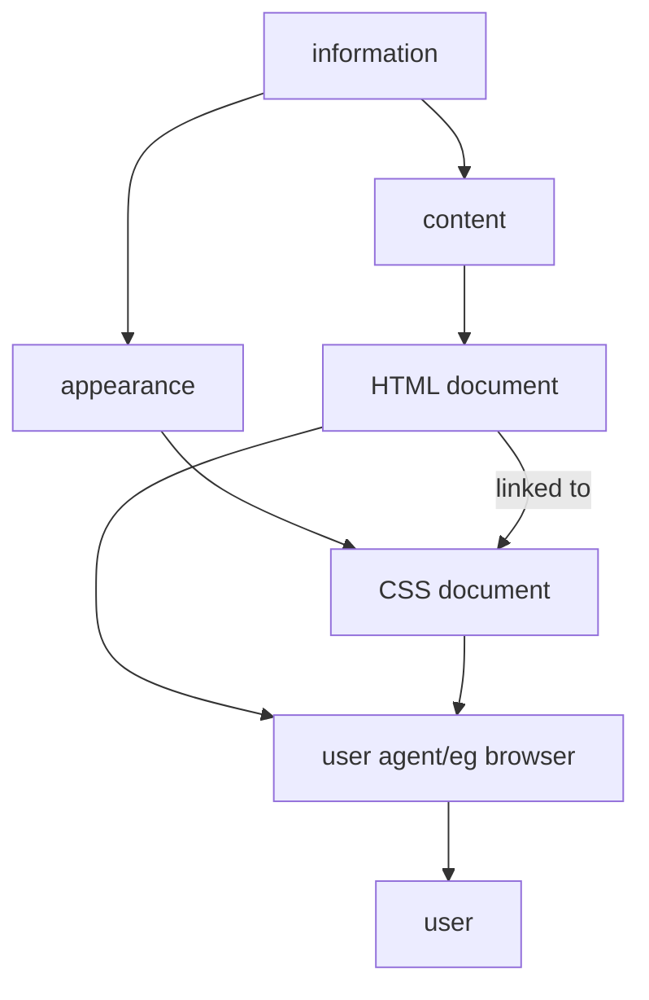

Logo

# UNIVERSIDADE LUSÓFONA

# Título do Trabalho

## Trabalho Final de curso
### Relatório Intercalar 1º Semestre

Nome do Aluno, número, curso
Nome do Aluno, número, curso

Orientador: nome
Co-orientador: nome
Entidade Externa: nome

Departamento de Engenharia Informática da Universidade Lusófona
Centro Universitário de Lisboa
Data

www.ulusofona.pt
---
Título do Trabalho Final de Curso

## Direitos de cópia

(Nome do trabalho), Copyright de (Nome do(s) aluno(s)), ULHT.

A Escola de Comunicação, Arquitectura, Artes e Tecnologias da Informação (ECATI) e a Universidade Lusófona de Humanidades e Tecnologias (ULHT) têm o direito, perpétuo e sem limites geográficos, de arquivar e publicar esta dissertação através de exemplares impressos reproduzidos em papel ou de forma digital, ou por qualquer outro meio conhecido ou que venha a ser inventado, e de a divulgar através de repositórios científicos e de admitir a sua cópia e distribuição com objectivos educacionais ou de investigação, não comerciais, desde que seja dado crédito ao autor e editor.

---
# Agradecimentos
---
Título do Trabalho Final de Curso

# Resumo

O resumo tem no máximo uma página. Pode ter como base a descrição da proposta de TFC disponível na plataforma. TFC aplicacional com nota 20 seria um trabalho que resolve um problema real, foi completamente implementado e está a correr em produção, com utilizadores reais a usá-lo.

Palavras chave:
---
# Abstract

Resumo em inglês.

Key-words:
---
Título do Trabalho Final de Curso

# Índice

Agradecimentos............................................................................................................................iii
Resumo.........................................................................................................................................iv
Abstract .........................................................................................................................................v
Índicevi
Lista de Figuras ...........................................................................................................................viii
Lista de Tabelas.............................................................................................................................ix
Lista de Siglas.................................................................................................................................x

## 1. Introdução................................................................................................................................1
### 1.1. Enquadramento ................................................................................................................1
### 1.2. Motivação e Identificação do Problema............................................................................1
### 1.3. Objetivos ...........................................................................................................................1
### 1.4. Estrutura do Documento...................................................................................................1

## 2. Pertinência e Viabilidade..........................................................................................................1
### 2.1. Pertinência ........................................................................................................................1
### 2.2. Viabilidade ........................................................................................................................1
### 2.3. Análise Comparativa com Soluções Existentes..................................................................1
#### 2.3.1. Soluções existentes ..................................................................................................1
#### 2.3.2. Análise de benchmarking .........................................................................................2
### 2.4. Proposta de inovação e mais-valias...................................................................................2
### 2.5. Identificação de oportunidade de negócio .......................................................................2

## 3. Especificação e Modelação.......................................................................................................3
### 3.1. Análise de Requisitos ........................................................................................................3
#### 3.1.1. Enumeração de Requisitos.......................................................................................3
#### 3.1.2. Descrição detalhada dos requisitos principais .........................................................3
#### 3.1.3. Casos de Uso/User Stories .......................................................................................3
### 3.2. Modelação ........................................................................................................................4
### 3.3. Protótipos de Interface .....................................................................................................4

## 4. Solução Proposta......................................................................................................................5
### 4.1. Apresentação ....................................................................................................................5
### 4.2. Arquitetura ........................................................................................................................5
### 4.3. Tecnologias e Ferramentas Utilizadas ...............................................................................5
### 4.4. Ambientes de Teste e de Produção...................................................................................5
---
4.5. Abrangência .......................................................................................................................6
4.6. Componentes .....................................................................................................................6
4.6.1. Componente 1..........................................................................................................6
4.6.2. Componente n..........................................................................................................6
4.7. Interfaces ..........................................................................................................................6
5. Testes e Validação.....................................................................................................................7
6. Método e Planeamento............................................................................................................8
6.1. Planeamento inicial...........................................................................................................8
6.2. Análise Crítica ao Planeamento.........................................................................................8
7. Resultados................................................................................................................................9
7.1. Resultados dos Testes .......................................................................................................9
7.2. Cumprimento de requisitos ..............................................................................................9
8. Conclusão...............................................................................................................................10
8.1. Conclusão........................................................................................................................10
8.2. Trabalhos Futuros............................................................................................................10
Bibliografia ..................................................................................................................................11
Anexo 1 – Recomendações para formatação de um relatório ....................................................12
Glossário......................................................................................................................................14
---
Título do Trabalho Final de Curso

# Lista de Figuras

Figura 1 – Processo de carregamento de uma página HTML.                                       12

---
# Lista de Tabelas

Tabela 1 Lista de Tecnologias usadas.                                    Erro! Marcador não definido.
Tabela 2 – Tipos de Selectores existentes.                                                         11

---

Título do Trabalho Final de Curso

# Lista de Siglas

| Sigla | Significado                            |
| ----- | -------------------------------------- |
| API   | Interface de Programação de Aplicações |
| HTML  | Linguagem de Marcação de Hipertexto    |

---
xi
---
# 1. Introdução

Neste capítulo pretende-se que seja descrito o enquadramento prático e a envolvente do problema em análise por formulação detalhada do case study a abordar no TFC.

Deverá ser demonstrado, de forma clara, que o problema em estudo resulta de circunstância reais e a solução a desenvolver representa um passo no sentido da solução desse mesmo problema

Valorizam-se os trabalhos cujo enquadramento seja fundamentado cientificamente ou suportado por terceiros. No presente contexto, entenda-se 'terceiros' como elementos externos ao desenvolvimento da solução, podendo incluir, sem se limitar, possíveis utilizadores da solução a desenvolver, eventuais clientes duma versão comercial da solução.

## 1.1. Enquadramento

Serve para situar o tema no contexto mais amplo, mostrando sua relevância na área de estudo. Apresentação de cada um dos conceitos (o que é) em torno dos quais o trabalho versa, incluindo referências bibliográficas relevantes.

## 1.2. Motivação e Identificação do Problema

Explicar as motivações que levam a propor o presente trabalho, evidenciando por que o tema é importante ou interessante, podendo incluir motivações pessoais ou sociais para a pesquisa. Definir o problema que que se pretende resolver ou explorar.

## 1.3. Objetivos

Apresentar os principais objetivos, tanto os gerais quanto os específicos, que guiam o trabalho.

## 1.4. Estrutura do Documento

Apresenta uma visão geral da organização do documento, listando o que se fala em cada capítulo. No presente relatório está organizado da seguinte forma:

- Na Secção 1 é apresentada a análise da viabilidade e pertinência do trabalho desenvolvido.
- Na Secção ...
- ...
- No Anexo ...
---
Título do Trabalho Final de Curso

O quadro abaixo é indicativo de entregáveis para cada momento de avaliação, assumindo abordagem sequencial do desenvolvimento de TFC. Podendo ser adoptadas outras abordagens metodológicas (e.g.: metodologias ágeis), serão aceites outras organizações de entregas. Deve-se, no entanto, observar duas condições: (i) a 1ª entrega deverá manter os conteúdos indicados no quadro, por forma a permitir ao júri avaliar a pertinência do tema e a taxa de esforço esperada; (ii) a organização de conteúdos em cada entrega deve ter atenção aos critérios de avaliação de modo a garantir a uniformidade da avaliação

Quadro de conteúdos Desenvolvimento

| Avaliação            | Tipo           | 1. Introduç | 2. Pertinên | 3.Especifi cação e | 4. Solução       | 5. Testes | 6.Métod o e | 7.Resul tados | 8.Concl usão |
| -------------------- | -------------- | ----------- | ----------- | ------------------ | ---------------- | --------- | ----------- | ------------- | ------------ |
| 1ª entrega Intercala | Qualitati va;  | Incluir     | Incluir     | incluir            | incluir          | N/A       | Inicial     | N/D           | N/D          |
| 2ª Entrega Intercala | Qualitati va;  | revisto     | revisto     | revisto            | revisto          | Incluir   | revisto     | N/D           | N/D          |
| Final                | Quantita tiva; | Final       | Final       | Final              | Solução Proposta | Final     | Final       | Incluir       | Incluir      |

---

## 2. Pertinência e Viabilidade

Desenvolver um inquérito de pertinência e viabilidade da solução proposta (a incluir como anexo), apresentando nesta secção os principais resultados sob a forma de gráficos, acompanhados de uma discussão.

### 2.1. Pertinência

Demonstrar que o trabalho em desenvolvimento tem impacto positivo e contribui para a resolução do problema identificado no capítulo anterior. Incluir validação por terceiros, como avaliações ou opiniões de especialistas, e descrever o impacto positivo esperado do projeto na resolução do problema. Desenvolver um inquérito de pertinência e viabilidade da solução proposta (a incluir como anexo), apresentando nesta secção os principais resultados sob a forma de gráficos, acompanhados de uma discussão.

### 2.2. Viabilidade

Viabilidade é a medida em que uma solução pode ser implementada e sustentada com sucesso. A viabilidade deverá ser avaliada por critérios econométricos, demonstrando-se que a solução proposta terá características para poder ser continuada após conclusão do TFC, não se esgotando enquanto projeto académico. Depende de vários fatores que devem ser avaliados: técnicos, económicos, sociais, ambientais. Deve ser feita uma reflexão e avaliação destes:

- Alinhamento com os Objetivos de Desenvolvimento Sustentável, identificando os ODS que o projeto pretende abordar e como se alinha com as metas específicas de cada ODS. Avaliar o impacto esperado do projeto nos ODS escolhidos.

- A viabilidade técnica refere-se à disponibilidade e adequação de ferramentas para executar a solução. Pode ser avaliada através de teste com um protótipo interativo (primeira entrega), ou um protótipo funcional e testes de aceitação (relatório final).

- A viabilidade económica refere-se aos custos e benefícios da solução, se é acessível, lucrativa e sustentável. Pode ser avaliada através de uma análise de custo-benefício, e retorno do investimento.

- A viabilidade social refere-se á aceitação e ao apoio da solução pelas partes interessadas, utilizadores e beneficiários envolvidos ou afetados pelo problema, avaliando se atende as necessidades, expectativas e preferências. Pode ser avaliada através de inquéritos e entrevistas e inquéritos de satisfação.

### 2.3. Análise Comparativa com Soluções Existentes

#### 2.3.1. Soluções existentes

Este capítulo destina-se à apresentação de análise comparativa da solução proposta face a alternativas e potenciais concorrentes existentes em mercado. Devem ser identificadas soluções existentes em mercado semelhantes ou associadas à solução proposta. Deve ser descrita sumariamente cada solução num parágrafo, incluindo uma referência bibliográfica.
---
Título do Trabalho Final de Curso

### 2.3.2. Análise de benchmarking

Análise comparativa da solução proposta com as soluções existentes. Esta deve ser suportada por uma tabela que resuma as características das soluções, organizando as soluções em colunas e os aspectos-chave em linhas, aferindo com "x" se a solução tem cada uma das características indicadas.

### 2.4. Proposta de inovação e mais-valias

O que torna a solução inovadora? Quais os principais elementos que diferencia das abordagens existentes? Quais as vantagens e benefícios que a proposta traz (melhoria eficiência, acessibilidade, impacto social, sustentabilidade)?

No caso de trabalhos realizados em parcerias empresariais, onde a inovação poderá estar condicionada por factores externos ao TFC, deve indicar-se mais-valias que este trará para o parceiro no contexto da parceria

### 2.5. Identificação de oportunidade de negócio

Com vista a fomentar o empreendedorismo tecnológico, se pertinente sugere-se proposta de negócio para exploração comercial do projecto desenvolvido ou sucedâneos.
---
# 3. Especificação e Modelação

Identificar detalhadamente características da solução a produzir sobre a forma de requisitos, modelos e outros elementos que permitam perceber a estrutura e características da solução a desenvolver. Incluir nesta secção conteúdos desenvolvidos na UC de Engenharia de Software, falando dos epics, features, user stories, technical user stories, etc. As primeiras duas secções podem ser adequadas.

## 3.1. Análise de Requisitos

Identificação detalhada de características da solução a produzir sobre a forma de requisitos.

Este levantamento não deve ser restringido ao âmbito do TFC nem aos requisitos efetivamente implementados durante o seu desenvolvimento. No relatório final, deve-se manter a enumeração original, com inclusão requisitos não implementados e cenários de continuidade do projecto em âmbito académico ou empresarial.

No relatório final dever-se-á manter a analise comparativa e avaliação de concretização das propostas realizadas na avaliação anterior. Neste sentido, o relatório deverá apresentar lista de requisitos propostos, indicando cumprimento, parcial ou integral, ou não implementação de cada um. Sempre que aplicável, também deverão ser indicados, justificadamente, requisitos modificados, retirados ou acrescentados. Se aplicável e em trabalhos realizados em parcerias com terceiros, dever-se-á indicar em particular alterações que resultem de orientações específicas dos parceiros

### 3.1.1. Enumeração de Requisitos

Lista geral de requisitos identificados para o problema em análise.

Deve indicar-se prioridade e impacto bem como classificação de tipo – e.g. funcional, não-funcional, sistema.

Com o evoluir do trabalho, particularmente na entrega final, dever-se-á indicar ajustes efectuados aos requisitos ao longo do desenvolvimento do TFC e indicação de concretização – p.e. implementação integral, parcial, substituição, cancelamento ou não realização

Estes requisitos deverão indicar critérios de aceitação, a validar em testes e que servirão de base para determinar o nível de concretização

### 3.1.2. Descrição detalhada dos requisitos principais

Para os requisitos de maior impacto deve ser apresentada descrição em detalhe onde se indique, entre outros, dependências, objectivos, critérios de aceitação e, se aplicável, processos de negócio, ligando a casos de uso da subsecção seguinte

### 3.1.3. Casos de Uso/User Stories

Representação de cenários de utilização real da solução proposta/desenvolvida, onde se apresente a exploração da solução por parte dos seus actores/utilizadores/stakeholders.
---
Título do Trabalho Final de Curso

A representação pode incluir casos de uso, processos ou outro formato pertinente contextualizar requisitos descritos nos pontos anteriores e para compreender o contexto de uso e exploração da solução

## 3.2. Modelação

Apresentar diagrama de entidade-relação (obrigatório) com todas as tabelas da aplicação, com o máximo nível de detalhe que conseguirem. O modelo deve ser apresentado em formato normalizado na 3ª forma normal, contendo todas as colunas e respetivos tipos e restrições adequadas, nomeadamente chave e regras de integridade.

Apresentar outras modelações pertinentes para as tecnologias que sejam utilizadas no TFC: Modelo de Classes; Diagramas de Atividade, etc.

## 3.3. Protótipos de Interface

Apresentar mapa aplicacional, que reflete os ecrãs da aplicação e a forma como se navega entre eles. Apresentar, de forma esquemática, os resultados esperados, o formato podendo ser diferente de acordo com a tipologia do TFC. Poderão incluir mockups, storyboards. Se desenvolvido, apresentar protótipo interativo. Apresentar representações mais relevantes para o projecto, deixando as restantes para um anexo.
---
## 4. Solução Proposta

Na entrega final o título deverá passar a Solução Desenvolvida, apresentando-se resultado final do trabalho em vez de perspectiva a desenvolver em fases posteriores

A cada entrega, deve-se realçar eventuais alterações face a proposta anteriores

### 4.1. Apresentação

Esta secção deve incluir descrição funcional da solução proposta, que, na entrega final, passa a solução desenvolvida. Na entrega final deve-se fazer análise comparativa entre as propostas realizadas ao longo do ano e solução ou protótipo implementado. A solução implementada pode ser um PoC ou MVP que não implementa completamente a solução proposta, mas valida o seu conceito.

A descrição deverá ter detalhe suficiente para que se consiga perceber já nesta fase como é que se compara com as soluções alternativas apresentadas no benchmarking.

Sempre que disponível, incluir uma lista com

* link para vídeo demonstrativo de funcionamento da solução desenvolvida,
* link para repositório Git
* link para solução funcional. Incluir credenciais de acesso e outras indicações úteis para utilização da solução disponibilizada.

Incluir um segundo parágrafo que apresenta as várias secções do capítulo.

### 4.2. Arquitetura

Incluir identificação, justificada detalhadamente, da solução e tecnologias a utilizar no desenvolvimento do TFC e fundamentação das principais opções na construção da solução.

Apresentação da arquitetura da solução proposta, com um desenho da arquitetura e seus componentes, que devem ser sumariamente apresentados.

### 4.3. Tecnologias e Ferramentas Utilizadas

Descrição das várias tecnologias usadas e ilustração, numa segunda imagem da arquitetura, dos perímetros tecnológicos.

Lista das ferramentas usadas, com descrição sucinta e justificação do uso, que deverá ser concordante com requisitos definidos anteriormente

### 4.4. Ambientes de Teste e de Produção

Descrever o ambiente produtivo da solução a desenvolver. Sempre que aplicável, indicar recursos necessários à exploração produtiva da solução: computacionais, de armazenamento e de rede (e.g. 500MB, 2GHz, 100 Mbps). Estes recursos poderão incluir
---
Título do Trabalho Final de Curso

serviços (e.g.: serviços Cloud; web services de terceiros) ou outros artefactos físicos (e.g.: drones; robôs)

## 4.5. Abrangência

Indicar unidades curriculares e as áreas científicas do curso aplicadas na solução proposta, descrevendo sumariamente que aspectos aprendidos serão utilizados e como.

## 4.6. Componentes

Detalhe de cada um dos componentes, realçando aspectos técnicos de sua implementação

### 4.6.1. Componente 1

### 4.6.2. Componente n

## 4.7. Interfaces

Mapa aplicacional composto por screenshots dos ecrãs mais representativos da aplicação, com uma descrição do que fazem, como é que foram implementados e que decisões foram tomadas na sua implementação.
---
# 5. Testes e Validação

Plano de testes para validação prática e operacional da solução construída. Mais do que demonstrar o funcionamento da solução, é importante que os testes demonstrem que ela cumpre os objetivos que se propôs, nomeadamente o de contribuir para a solução de um problema real, demonstrando aplicabilidade, pertinência e relevância.

Os testes a realizar devem incidir sobre qualidade da solução desenvolvida, validação de funcionamento e de operação em contexto produtivo, podendo-se acrescentar outros formatos que se considerem relevantes para a natureza do trabalho.

Nesta secção, deve-se incluir abordagem e justificação para os testes, sempre que possível recorrendo a modelos formais de análise de riscos e de impacto¹. Em anexo, deve-se apresentar guião detalhado de testes, com descrição de cenários e resultados

Sempre que possível, os testes de validação operacional devem incluir verificação dos recursos indicados (computacionais, armazenamento e rede, assim como serviços cloud ou web services de terceiros ou artefactos físicos)

Tal como acontece com o formato da solução proposta, também o plano de testes e validação deverá ser coerente com a natureza do trabalho e alinhado com os requisitos definidos, com particular incidência na demonstração de cumprimento dos critérios de aceitação.

Valorizam-se trabalhos com plano de testes e validação a decorrerem em ambientes reais e com forte participação terceiros².

----

¹ e.g.: Fault Tree Analysis, Diagrama causa-efeito; Ishikawa

² No caso de validações por terceiros, a demonstração poderá ser realizada por questionários de satisfação, entrevistas ou testemunhos individuais. Nestes casos, o anexo de testes deve incluir inquéritos a aplicar, guiões de entrevistas ou descrição de outros processos de obtenção de avaliação de utilizadores ou outros stakeholders
---
Título do Trabalho Final de Curso

## 6. Método e Planeamento

### 6.1. Planeamento inicial

Descrição do método de trabalho seguido no desenvolvimento do projecto. Ao elaborar este capítulo os alunos devem ter como referência o calendário proposto nos relatórios.

Deve ser incluído um plano de trabalho e cronograma (gantt chart) orientado à gestão de projeto. O cronograma deve ser suficientemente detalhado para incluir unidades de trabalho de implementação dos componentes descritos em 4.6 e esforço alocado à implementação de requisitos.

Em alternativa, pode-se apresentar planeamento em abordagem Agile, mostrando-se os artefactos adequados à preparação de trabalho – e.g. Backlogs – e os vários sprints realizados. Mantém-se a necessidade de apresentar tarefas e esforço alocado a implementação de user stories

No último relatório, aconselha-se que o calendário seja construindo tendo como orientação uma hipotética disponibilização publica da solução construída, focando na realização de testes, qualidade e aceitação, e eventual implementação.

Aconselha-se uma análise crítica sobre o cumprimento do calendário e indicações do progresso do trabalho, onde se refira tarefas realizadas, dificuldades mais marcantes e alterações que tenham sido introduzidas ao plano e objectivos iniciais.

### 6.2. Análise Crítica ao Planeamento

Aconselha-se uma análise crítica sobre o cumprimento do calendário e indicações do progresso do trabalho, onde se refira tarefas realizadas, dificuldades mais marcantes e alterações que tenham sido introduzidas ao plano e objectivos anteriores.

Esta secção é aconselhada na segunda entrega e indispensável na final
---
# 7. Resultados

## 7.1. Resultados dos Testes

Descrição detalhada de resultados, outputs e outcomes.

Incluído anexo com os test cases e respetivos resultados.

Valorizam-se trabalhos onde a avaliação de critérios de cumprimento de requisitos e test cases seja efetuada por terceiros³, devendo os resultados de inquéritos, entrevistas e testemunhos serem incluídos em anexo

## 7.2. Cumprimento de requisitos

Apresentar uma tabela com todos os requisitos indicados no capítulo 3 e uma indicação para cada um: realizado, realizado parcialmente, não realizado, abandonado. Nestes 3 últimos casos, apresentar uma justificação.

----

³ Os testes de aceitação por terceiros podem ser realizados, entre outras hipóteses, por meio de inquéritos de satisfação a potenciais utilizadores reais, realização de test cases previamente determinados, utilização efetiva da solução em contexto real, etc.
---
Título do Trabalho Final de Curso

# 8. Conclusão

## 8.1. Conclusão

Analise crítica da realização do TFC, onde se abordem, entre outras, questões como:

- Grau de concretização do plano
- Diferenças entre solução proposta inicialmente e solução desenvolvida
- Evolução do trabalho e conhecimentos ao longo do TFC
- O que se faria diferente se o TFC voltasse ao princípio
- Maiores dificuldades na realização do TFC

## 8.2. Trabalhos Futuros

Assumindo que o trabalho pudesse ser continuados, quais os próximos passos? Como se pode melhorar a solução

Tendo em vista a vertente de inovação e empreendedorismo, o que se pode fazer para aumentar o potencial da solução?
---
# Bibliografia

[DEISI24]    DEISI, Regulamento de Trabalho Final de Curso, Out. 2024.

[DEISI24b]   DEISI, www.deisi.ulusofona.pt, Out. 2024.

[TaWe20]     Tanenbaum,A. e Wetherall,D., Computer Networks, 6ª Edição, Prentice Hall, 2020.

[ULHT21]     Universidade Lusófona de Humanidades e Tecnologia, www.ulusofona.pt, acedido em Out. 2024.
---
Título do Trabalho Final de Curso

# Anexo 1 – Recomendações para formatação de um relatório

A escrita do relatório deve seguir o presente template, não mudando nada em termos de formatação (fontes, espaçamentos, tamanhos, etc). Este anexo exemplificativo deverá ser removido antes de submeter o seu relatório. Antes de entregar o relatório, exercite a sua capacidade de auto-crítica lendo-o e verificando se está adequadamente redigido.

Na Tabela 1 exemplifica-se uma tabela e a forma como esta deve ser referenciada. Como poderá ver, se passar com o rato por cima da palavra "Tabela 1", neste parágrafo, aparece o hiperlink. Tal é possível se for incluída uma referência da forma que se explica a seguir. As tabelas devem ser apresentadas sempre depois de referenciadas. A legenda da tabela deve ser inserida através da opção do menu References\Insert caption (no menu em cima do MS Word), sempre no topo da tabela. A referência a uma tabela insere-se através do comando References\cross-reference, sendo a sua numeração automática.

| Tipo            | Exemplo           |
| --------------- | ----------------- |
| Universal       | \*                |
| Classe          | .class1           |
| ID              | #element          |
| Atributo        | \[target=\_blank] |
| Pseudo-classe   | div:hover         |
| Pseudo-elemento | p::first-letter   |

O processo de carregamento de uma página HTML está representado na Figura 1 para exemplificar como se deve inserir uma legenda a uma figura assim como uma referência a esta mesma. Para inserir uma Figura, seleccione References\Insert Caption e indique que quer inserir uma Figura. A figura deve sempre aparecer depois de ser referida no texto. Para inserir uma referência a uma figura, utilizar References\Cross-reference. O índice e listas de tabelas e figuras (mas páginas iii a v) actualizam-se automaticamente se inseridas desta forma. Para actualizar basta selecionar todo o texto e premir F9.

Figura 1 – Processo de carregamento de uma página HTML.

Explica-se de seguida a inserção de referências bibliográficas. Qualquer texto ou ideia que venha de uma referencia bibliográfica deve ser indicada com uma referência. Por exemplo, podemos referir que este trabalho se enquadra dentro do regulamento do Trabalho Final de
---
Curso [DEISI24]. O hyperlink aponta para a referencia bibliográfica inserida relativa ao regulamento de TFC. Para sua criação deve:

1. escrever o texto que pretende na bibliografia

2. usar uma numeração adequada [], de forma a que respeite a ordem de aparecimento da referencia no texto.

3. selecionar a referência inserida com o rato (por exemplo [2]) e escolher em Insert\Bookmark, criando um nome associado à referencia.

Depois, no texto onde pretender pode inserir a referência através de Insert\Cross-reference.
---
Título do Trabalho Final de Curso

## Glossário

| Sigla | Significado                            |
| ----- | -------------------------------------- |
| LEI   | Licenciatura em Engenharia Informática |
| LIG   | Licenciatura em Informática de Gestão  |
| TFC   | Trabalho Final de Curso                |
