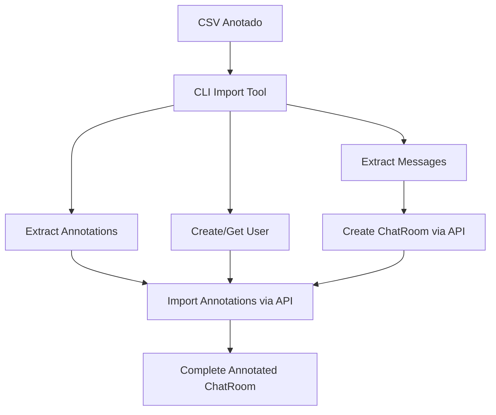

# Estratégia de Importação de Chatrooms Anotados

**Data:** 26 de janeiro de 2025  
**Versão:** 2.0  
**Objetivo:** Implementar um sistema simples e eficiente para importar chatrooms que já contêm anotações completas de thread disentanglement.

---

## 1. Análise da Realidade Atual

### 1.1 O Que Temos

**CSVs Anotados Completos:**
- Ficheiros CSV que contêm **chatroom completo + anotações**
- Cada ficheiro representa o mesmo chat anotado por uma pessoa diferente
- Estrutura: `user_id;turn_id;turn_text;reply_to_turn;[thread_column]`
- Exemplos reais: `VAC_R10-joao.csv`, `VAC_R10-zuil.csv`, `VAC_R10-fabio.csv`

**Exemplo de Estrutura Real:**
```csv
user_id;turn_id;turn_text;reply_to_turn;thread
1280;VAC_R10_001;Olá! Sou o moderador...;;0
1969;VAC_R10_002;Na minha opinião a vacinação...;;0
1953;VAC_R10_003;Na minha opinião eu não acho...;;0
1957;VAC_R10_004;Direito. Estamos num país livre...;;0
```

**Características dos Dados:**
- ✅ **Dados Completos**: Cada CSV tem todas as mensagens + anotações
- ✅ **Auto-Suficientes**: Cada ficheiro é um dataset completo
- ✅ **Mesmas Mensagens**: Ficheiros diferentes contêm as mesmas mensagens com anotações diferentes
- ✅ **Diferentes Anotadores**: Cada ficheiro representa o trabalho de um anotador
- ✅ **Formatos Variáveis**: Colunas podem ser `thread`, `Thread_zuil`, etc.

### 1.2 O Que NÃO Precisamos

❌ **Formato JSON Complexo**: Os CSVs já são auto-suficientes  
❌ **Sistema de Batch**: Cada ficheiro é processado independentemente  
❌ **Conversão Prévia**: Podemos processar CSVs diretamente  
❌ **APIs Novas**: Infraestrutura existente é suficiente  
❌ **Schemas Complexos**: Estrutura simples resolve tudo  

---

## 2. Abordagem Simplificada

### 2.1 Conceito Central

**Cada CSV = Um Chatroom Anotado Completo**

Cada ficheiro CSV será importado como:
- **Um chatroom** com todas as mensagens
- **Um conjunto de anotações** associadas a um utilizador específico
- **Independente** de outros ficheiros

### 2.2 Fluxo de Trabalho



### 2.3 Infraestrutura Existente (REUTILIZAR)

**APIs que já existem e funcionam:**
- `POST /admin/projects/{id}/import-chat-room-csv` - Importa mensagens de chat
- `POST /admin/chat-rooms/{id}/import-annotations` - Importa anotações para utilizador
- `POST /admin/users` - Cria novos utilizadores

**Não precisamos de:**
- Novos endpoints
- Novos schemas
- Modificações no backend
- Modificações no frontend

---

## 3. Implementação: CLI Simples

### 3.1 Ferramenta de Linha de Comando

**Ficheiro: `import_annotated_chatroom.py`**

```python
#!/usr/bin/env python3
"""
Importa um chatroom anotado completo a partir de um ficheiro CSV.

Usage:
    python import_annotated_chatroom.py \
        --csv-file "VAC_R10-joao.csv" \
        --annotator-email "joao@example.com" \
        --annotator-name "João Silva" \
        --project-id 123 \
        --chatroom-name "VAC_R10 - João's Annotations"
"""

def main():
    # 1. Parse command line arguments
    # 2. Read and validate CSV file
    # 3. Detect thread column automatically
    # 4. Create user if doesn't exist
    # 5. Import chatroom (messages) via existing API
    # 6. Import annotations via existing API
    # 7. Report results
```

### 3.2 Parâmetros de Entrada

**Obrigatórios:**
- `--csv-file`: Caminho para o ficheiro CSV
- `--annotator-email`: Email do anotador (será criado se não existir)
- `--project-id`: ID do projeto onde importar

**Opcionais:**
- `--annotator-name`: Nome do anotador (default: extraído do email)
- `--chatroom-name`: Nome do chatroom (default: baseado no ficheiro)
- `--api-base-url`: URL da API (default: localhost)
- `--admin-email`: Email do admin (para autenticação)
- `--admin-password`: Password do admin

### 3.3 Detecção Automática

**Colunas de Thread:**
- Procura automática por: `thread`, `Thread_*`, `thread_id`, `thread_column`
- Valida se coluna contém valores válidos
- Reporta estatísticas de anotações encontradas

**Exemplo de Detecção:**
```
✅ Found thread column: 'Thread_zuil'
📊 Statistics:
   - Total messages: 160
   - Annotated messages: 156 (97.5%)
   - Unique threads: 13 (0-12)
   - Thread distribution: 0(98), 1(12), 2(8), 3(15), 4(3), ...
```

---

## 4. Casos de Uso

### 4.1 Cenário Típico: Estudo IAA

**Situação:** 3 anotadores anotaram o mesmo chat de vacinação

**Processo:**
```bash
# Criar projeto
curl -X POST http://localhost:8000/admin/projects/ \
  -d '{"name": "VAC_R10 Study", "description": "Vaccination debate IAA study"}'

# Importar anotações do João
python import_annotated_chatroom.py \
  --csv-file "VAC_R10-joao.csv" \
  --annotator-email "joao@study.com" \
  --annotator-name "João Silva" \
  --project-id 1 \
  --chatroom-name "VAC_R10 - João"

# Importar anotações da Ana  
python import_annotated_chatroom.py \
  --csv-file "VAC_R10-ana.csv" \
  --annotator-email "ana@study.com" \
  --annotator-name "Ana Santos" \
  --project-id 1 \
  --chatroom-name "VAC_R10 - Ana"

# Importar anotações do Carlos
python import_annotated_chatroom.py \
  --csv-file "VAC_R10-carlos.csv" \
  --annotator-email "carlos@study.com" \
  --annotator-name "Carlos Lopes" \
  --project-id 1 \
  --chatroom-name "VAC_R10 - Carlos"
```

**Resultado:** 3 chatrooms no mesmo projeto, prontos para análise de concordância.

### 4.2 Análise de Concordância

**Via Interface Web:**
- Navegar para o projeto
- Ver 3 chatrooms com as mesmas mensagens
- Comparar anotações entre anotadores
- Usar ferramentas de análise existentes

**Via API:**
```python
# Obter anotações agregadas para análise
response = requests.get(f"/admin/projects/{project_id}/aggregated-annotations")
iaa_data = response.json()

# Calcular métricas de concordância
kappa_score = calculate_fleiss_kappa(iaa_data)
```

---

## 5. Vantagens da Abordagem Simplificada

### 5.1 Desenvolvimento

✅ **Rápido**: Usa infraestrutura existente  
✅ **Simples**: Uma ferramenta, um objetivo  
✅ **Testável**: Fácil de testar e debuggar  
✅ **Manutenível**: Código linear e claro  

### 5.2 Utilização

✅ **Intuitivo**: Cada CSV = uma importação  
✅ **Flexível**: Funciona com diferentes formatos de CSV  
✅ **Repetível**: Pode reimportar se necessário  
✅ **Auditável**: Logs claros de cada importação  

### 5.3 Escalabilidade

✅ **Paralelizável**: Múltiplas importações simultâneas  
✅ **Memória Eficiente**: Processa um ficheiro de cada vez  
✅ **Recuperável**: Falhas não afetam outras importações  

---

## 6. Implementação Detalhada

### 6.1 Algoritmo Principal

```python
def import_annotated_chatroom(csv_file, annotator_email, project_id, **kwargs):
    """
    Importa um chatroom anotado completo.
    
    Steps:
    1. Validate inputs
    2. Parse CSV and detect structure
    3. Create/get annotator user
    4. Prepare chatroom data (messages only)
    5. Import chatroom via API
    6. Prepare annotations data
    7. Import annotations via API
    8. Return results
    """
    
    # Step 1: Validate
    if not os.path.exists(csv_file):
        raise ValueError(f"CSV file not found: {csv_file}")
    
    # Step 2: Parse CSV
    df = pd.read_csv(csv_file, delimiter=';')
    messages, annotations = parse_csv_structure(df)
    
    # Step 3: Create user
    user_id = create_or_get_user(annotator_email, kwargs.get('annotator_name'))
    
    # Step 4: Import chatroom
    chatroom_data = prepare_chatroom_csv(messages)
    chatroom_id = import_chatroom_via_api(project_id, chatroom_data)
    
    # Step 5: Import annotations
    annotations_data = prepare_annotations_csv(annotations)
    import_annotations_via_api(chatroom_id, user_id, annotations_data)
    
    return {
        'chatroom_id': chatroom_id,
        'user_id': user_id,
        'messages_count': len(messages),
        'annotations_count': len(annotations)
    }
```

### 6.2 Detecção de Estrutura

```python
def parse_csv_structure(df):
    """
    Extrai mensagens e anotações do DataFrame.
    
    Returns:
        messages: List[Dict] - Para criar chatroom
        annotations: List[Dict] - Para importar anotações
    """
    
    # Detect thread column
    thread_column = detect_thread_column(df)
    if not thread_column:
        raise ValueError("No thread column found in CSV")
    
    # Extract messages (for chatroom creation)
    messages = []
    for _, row in df.iterrows():
        messages.append({
            'turn_id': str(row['turn_id']),
            'user_id': str(row['user_id']),
            'turn_text': str(row['turn_text']),
            'reply_to_turn': str(row['reply_to_turn']) if pd.notna(row['reply_to_turn']) else None
        })
    
    # Extract annotations
    annotations = []
    for _, row in df.iterrows():
        if pd.notna(row[thread_column]):
            annotations.append({
                'turn_id': str(row['turn_id']),
                'thread_id': str(row[thread_column])
            })
    
    return messages, annotations

def detect_thread_column(df):
    """Deteta automaticamente a coluna de threads."""
    candidates = ['thread', 'thread_id', 'thread_column']
    
    # Add dynamic detection for Thread_* patterns
    for col in df.columns:
        if col.lower().startswith('thread'):
            candidates.append(col)
    
    for candidate in candidates:
        if candidate in df.columns:
            # Validate that column has meaningful data
            non_null_values = df[candidate].dropna()
            if len(non_null_values) > 0:
                return candidate
    
    return None
```

### 6.3 Interface com APIs Existentes

```python
def import_chatroom_via_api(project_id, messages):
    """Usa API existente para criar chatroom."""
    
    # Prepare CSV content for existing API
    csv_content = prepare_csv_for_api(messages)
    
    # Call existing endpoint
    files = {'file': ('chatroom.csv', csv_content, 'text/csv')}
    response = requests.post(
        f'{API_BASE}/admin/projects/{project_id}/import-chat-room-csv',
        files=files,
        headers={'Authorization': f'Bearer {get_admin_token()}'}
    )
    
    if response.status_code != 200:
        raise RuntimeError(f"Failed to import chatroom: {response.text}")
    
    return response.json()['chat_room_id']

def import_annotations_via_api(chatroom_id, user_id, annotations):
    """Usa API existente para importar anotações."""
    
    # Prepare CSV content for existing API
    csv_content = prepare_annotations_csv_for_api(annotations)
    
    # Call existing endpoint
    files = {'file': ('annotations.csv', csv_content, 'text/csv')}
    data = {'annotator_id': user_id}
    
    response = requests.post(
        f'{API_BASE}/admin/chat-rooms/{chatroom_id}/import-annotations',
        files=files,
        data=data,
        headers={'Authorization': f'Bearer {get_admin_token()}'}
    )
    
    if response.status_code != 200:
        raise RuntimeError(f"Failed to import annotations: {response.text}")
    
    return response.json()
```

---

## 7. Exemplo de Uso Completo

### 7.1 Preparação

```bash
# Install dependencies
pip install pandas requests click

# Set up environment
export API_BASE_URL="http://localhost:8000"
export ADMIN_EMAIL="admin@example.com"
export ADMIN_PASSWORD="secure_password"
```

### 7.2 Importação

```bash
# Import João's annotated chatroom
python import_annotated_chatroom.py \
    --csv-file "./annotated_csvs/VAC_R10-joao.csv" \
    --annotator-email "joao.silva@research.pt" \
    --annotator-name "João Silva" \
    --project-id 1 \
    --chatroom-name "VAC_R10 Vaccination Debate - João's Annotations"

# Expected output:
# ✅ CSV file validated: 160 messages found
# ✅ Thread column detected: 'thread'
# ✅ Annotation statistics: 156/160 messages annotated (97.5%)
# ✅ User created: joao.silva@research.pt (ID: 15)
# ✅ Chatroom imported: "VAC_R10 Vaccination Debate - João's Annotations" (ID: 42)
# ✅ Annotations imported: 156 annotations successfully processed
# 
# 🎯 Import completed successfully!
#    Chatroom ID: 42
#    Total messages: 160
#    Total annotations: 156
#    Import time: 3.2 seconds
```

### 7.3 Verificação

```bash
# Verify in web interface
open "http://localhost:3000/admin/projects/1"

# Or via API
curl -H "Authorization: Bearer $TOKEN" \
     "http://localhost:8000/admin/projects/1/chat-rooms"
```

---

## 8. Plano de Implementação

### 8.1 Fase Única (1-2 dias)

**Dia 1: Desenvolvimento**
- [ ] Criar script `import_annotated_chatroom.py`
- [ ] Implementar parsers de CSV
- [ ] Implementar interface com APIs existentes
- [ ] Adicionar logging e error handling

**Dia 2: Testes e Refinamento**
- [ ] Testar com ficheiros reais (VAC_R10-*.csv)
- [ ] Validar integração com backend
- [ ] Documentar utilização
- [ ] Criar exemplos de uso

### 8.2 Entregáveis

- ✅ **Script funcional**: `import_annotated_chatroom.py`
- ✅ **Documentação**: README com exemplos
- ✅ **Testes**: Scripts importam ficheiros reais com sucesso
- ✅ **Validação**: Dados aparecem corretamente na interface web

---

## 9. Benefícios Finais

### 9.1 Simplicidade
- **Uma ferramenta, um objetivo**: Cada CSV vira um chatroom anotado
- **Zero modificações no backend**: Usa infraestrutura existente
- **Processo linear**: CSV → Parse → API calls → Done

### 9.2 Eficiência
- **Rápido desenvolvimento**: 1-2 dias vs semanas
- **Fácil manutenção**: Código simples e direto
- **Fácil depuração**: Problemas são localizados e óbvios

### 9.3 Flexibilidade
- **Diferentes formatos**: Adapta-se a variações nos CSVs
- **Reutilizável**: Serve para qualquer dataset similar
- **Extensível**: Fácil adicionar novas funcionalidades

---

## 10. Conclusão

Esta abordagem simplificada resolve o problema real de forma elegante e eficiente:

- ✅ **Importa chatrooms anotados** existentes
- ✅ **Reutiliza infraestrutura** atual
- ✅ **Processo claro e simples** de entender
- ✅ **Rápido de implementar** e testar
- ✅ **Facilita análise IAA** imediata

**Próximos passos:** Implementar o script e testar com os ficheiros VAC_R10 reais.