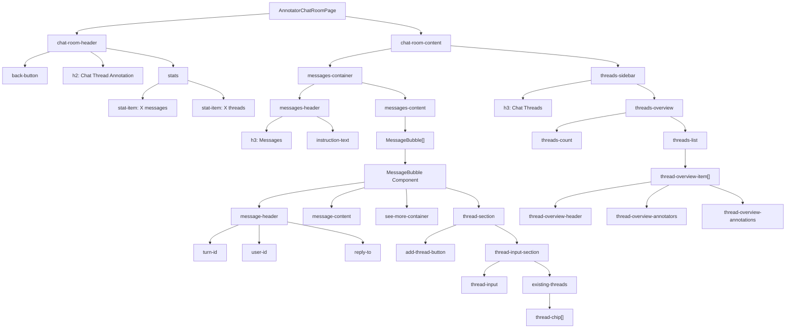

# Chat Thread Annotation View - Complete Analysis & Requirements

## Table of Contents
1. [Current Component Architecture](#current-component-architecture)
2. [Component Tree Diagram](#component-tree-diagram)
3. [Detailed Component Breakdown](#detailed-component-breakdown)
4. [New Requirements & Features](#new-requirements--features)
5. [UI/UX Improvements](#uiux-improvements)
6. [API Optimization Needs](#api-optimization-needs)
7. [Keyboard Navigation & Workflow](#keyboard-navigation--workflow)
8. [Progress Tracking & Statistics](#progress-tracking--statistics)
9. [Implementation Priority Matrix](#implementation-priority-matrix)

---

## Current Component Architecture

### Main Container: `AnnotatorChatRoomPage`
- **Purpose**: Primary container managing all chat room annotation functionality
- **State Management**: Messages, annotations, threads, user data, loading states
- **API Calls**: Fetches messages, annotations, user data; handles create/delete operations

### Layout Structure:
```
AnnotatorChatRoomPage
├── chat-room-header
│   ├── back-button
│   ├── h2 (title)
│   └── stats (message/thread counters)
└── chat-room-content
    ├── messages-container (LEFT SIDE)
    │   ├── messages-header
    │   │   ├── h3 (Messages)
    │   │   └── instruction-text
    │   └── messages-content
    │       └── MessageBubble[] (array)
    └── threads-sidebar (RIGHT SIDE)
        ├── h3 (Chat Threads)
        └── threads-overview
            ├── threads-count
            └── threads-list
                └── thread-overview-item[]
```

---

## Component Tree Diagram



---

## Detailed Component Breakdown

### MessageBubble Component
**Current Elements:**
- **message-header**: Turn ID, User ID, Reply-to badges
- **message-content**: Message text with expand/collapse
- **see-more-container**: Expand/collapse button
- **thread-section**: Annotation controls
  - **add-thread-button**: Add/Change/Cancel thread
  - **thread-input-section**: Input field + existing thread chips
  - **error-message**: Error display

**Current Styling:**
- Chat bubble appearance (75% max-width, right-aligned)
- Green left border for annotated messages
- Hover effects and transitions
- Theme-consistent colors using CSS variables

### Thread Overview Items (Sidebar)
**Current Elements:**
- **thread-overview-header**: Thread name + message count
- **thread-overview-annotators**: List of contributing annotators
- **thread-overview-annotations**: Preview of all annotations (Turn X by email)

---

## New Requirements & Features

### 1. Enhanced Statistics & Progress Tracking
**REQUIRED:**
- [ ] **Annotation Progress Percentage**: X% of messages annotated
- [ ] **Message Statistics**: 
  - Total messages count
  - Annotated messages count
  - Unannotated messages count
  - Percentage breakdown
- [ ] **Thread Statistics**:
  - Messages per thread (percentage)
  - Annotators per thread
  - Thread completion metrics

### 2. Smart Thread Cards with Hover Interaction
**REQUIRED:**
- [ ] **Hoverable Thread Cards**: Show expanded view on hover
- [ ] **Message List in Hover**: Scrollable list of all messages in thread
- [ ] **Message Selection**: Click message in hover → highlight corresponding bubble
- [ ] **Thread Card Clickability**: Click thread card → highlight all tagged messages
- [ ] **Visual Feedback**: Clear highlighting system for selected/related messages

### 3. User Interaction Improvements
**REQUIRED:**
- [ ] **User ID Click**: Highlight all messages from same user
- [ ] **Turn ID Simplification**: Show only numeric part (not full string)
- [ ] **Message Bubble Highlighting**: Multiple highlight states:
  - Selected message
  - Same user messages
  - Same thread messages
  - Combinations of above

### 4. Thread Input UX Enhancements
**REQUIRED:**
- [ ] **Repositioned Thread Selection**: Move existing threads closer to button
- [ ] **Keyboard Navigation**: Arrow keys to navigate existing threads
- [ ] **Immediate Typing**: Start typing immediately without clicking input
- [ ] **Quick Selection**: Enter to select highlighted existing thread
- [ ] **Tab Navigation**: Tab key jumps to next message annotation
- [ ] **Workflow Optimization**: Seamless keyboard-only annotation workflow

### 5. Tutorial/Help System
**REQUIRED:**
- [ ] **Dismissible Instructions**: Closeable help text
- [ ] **Persistent but Hideable**: Tutorial that can be toggled on/off
- [ ] **Space Optimization**: Remove instruction space when closed

---

## UI/UX Improvements

### Visual Design Enhancements
**NEEDED:**
- [ ] **Button Redesign**: Move away from flat "Add Thread"/"Change Thread" buttons
- [ ] **Size Optimization**: Better balance of button sizes and positioning
- [ ] **Layout Fluidity**: More cohesive and flowing design
- [ ] **Pretty but Simple**: Maintain simplicity while improving aesthetics

### Interaction Flow Improvements
**NEEDED:**
- [ ] **Faster Thread Selection**: Optimize mouse/keyboard workflow
- [ ] **Smart Defaults**: Better default behaviors for common actions
- [ ] **Context Awareness**: UI adapts based on user's current action
- [ ] **Reduced Cognitive Load**: Minimize decision points for users

### Thread Management UX
**NEEDED:**
- [ ] **Existing vs New Thread Balance**: Optimize selection vs creation workflow
- [ ] **Progressive Enhancement**: As more threads exist, favor selection over creation
- [ ] **Visual Hierarchy**: Clear priority between create new vs select existing

---

## API Optimization Needs

### Current API Issues
**IDENTIFIED:**
- [ ] **Multiple API Calls**: Separate calls for messages, annotations, user data
- [ ] **Refresh After Actions**: Full annotation refresh after create/delete
- [ ] **No Real-time Updates**: Manual refresh required

### Optimization Opportunities
**PROPOSED:**
- [ ] **Batch API Calls**: Single endpoint for all chat room data
- [ ] **Incremental Updates**: Update only changed data, not full refresh
- [ ] **Optimistic Updates**: Update UI immediately, sync with backend
- [ ] **Caching Strategy**: Reduce redundant API calls
- [ ] **Real-time Sync**: WebSocket or polling for live updates

---

## Keyboard Navigation & Workflow

### Proposed Keyboard Shortcuts
**WORKFLOW:**
1. **Tab**: Navigate between message bubbles
2. **Enter**: Open annotation for current message
3. **Arrow Keys**: Navigate existing thread options
4. **Enter**: Select highlighted thread
5. **Escape**: Cancel annotation
6. **Type**: Immediately start creating new thread

### Navigation States
**REQUIRED:**
- [ ] **Focus Management**: Clear visual focus indicators
- [ ] **Keyboard Accessibility**: Full keyboard navigation support
- [ ] **Workflow Continuity**: Seamless progression through messages
- [ ] **Context Preservation**: Remember user's position and state

---

## Progress Tracking & Statistics

### Header Statistics Enhancement
**CURRENT:** Basic message/thread counts
**PROPOSED:**
- [ ] **Progress Bar**: Visual annotation completion percentage
- [ ] **Detailed Metrics**: Expandable stats panel
- [ ] **Real-time Updates**: Statistics update as user annotates

### Thread-Level Analytics
**PROPOSED:**
- [ ] **Thread Density**: Messages per thread visualization
- [ ] **Annotator Contribution**: Who annotated what percentage
- [ ] **Completion Status**: Which threads are "complete" vs "in progress"

### Message-Level Indicators
**PROPOSED:**
- [ ] **Annotation Status Icons**: Visual indicators on message bubbles
- [ ] **Progress Colors**: Color coding for annotation states
- [ ] **Batch Operations**: Select multiple messages for bulk annotation

---

## Implementation Priority Matrix

### HIGH PRIORITY (Core Functionality)
1. **Turn ID Simplification** - Simple text change
2. **User ID Click Highlighting** - Core interaction improvement
3. **Thread Card Click Highlighting** - Essential for workflow
4. **Dismissible Instructions** - Immediate UX improvement
5. **Statistics Enhancement** - Critical for progress tracking

### MEDIUM PRIORITY (UX Improvements)
1. **Thread Input Repositioning** - Workflow optimization
2. **Keyboard Navigation** - Accessibility and efficiency
3. **Hover Thread Cards** - Advanced interaction
4. **Button Redesign** - Visual improvement
5. **API Optimization** - Performance enhancement

### LOW PRIORITY (Advanced Features)
1. **Tab Navigation Between Messages** - Advanced workflow
2. **Real-time Updates** - Nice to have
3. **Batch Operations** - Power user feature
4. **Advanced Analytics** - Reporting feature

---

## Technical Considerations

### Component Refactoring Needs
**IDENTIFIED:**
- [ ] **MessageBubble**: Add highlight states, user click handling
- [ ] **ThreadOverviewItem**: Add hover interactions, click handling
- [ ] **AnnotatorChatRoomPage**: Enhanced statistics, keyboard navigation
- [ ] **New Components**: HoverableThreadCard, ProgressIndicator, KeyboardNavigator

### State Management Updates
**REQUIRED:**
- [ ] **Highlight States**: Track which messages/users/threads are highlighted
- [ ] **Keyboard Navigation State**: Current focus, navigation mode
- [ ] **Statistics State**: Cached calculations for performance
- [ ] **UI State**: Tutorial visibility, expanded states

### CSS Architecture Changes
**NEEDED:**
- [ ] **Highlight System**: Multiple highlight classes that can combine
- [ ] **Animation System**: Smooth transitions for state changes
- [ ] **Responsive Design**: Better mobile/tablet support
- [ ] **Theme Consistency**: Ensure all new elements use CSS variables

---

## Current vs. Desired State Summary

### What We Have (CURRENT)
✅ Basic message bubble display  
✅ Simple thread annotation  
✅ Basic thread sidebar  
✅ Theme consistency  
✅ Expand/collapse messages  
✅ Existing thread selection  

### What We Need (GAPS)
❌ Advanced highlighting system  
❌ Progress tracking/statistics  
❌ Keyboard navigation workflow  
❌ Smart thread card interactions  
❌ User-based message filtering  
❌ Optimized API calls  
❌ Enhanced visual design  
❌ Dismissible tutorial system  

### What We Want to Optimize (IMPROVEMENTS)
🔄 Thread input UX (positioning, keyboard)  
🔄 Button design and sizing  
🔄 Layout fluidity and aesthetics  
🔄 API efficiency  
🔄 Overall workflow speed  
🔄 Visual feedback systems  

---

## Next Steps

1. **Requirements Validation**: Confirm priority and scope of each feature
2. **Technical Design**: Create detailed implementation plans for high-priority items
3. **Component Design**: Sketch new component interfaces and interactions
4. **API Design**: Plan optimized endpoints and data structures
5. **Implementation Planning**: Break down work into manageable chunks
6. **Testing Strategy**: Plan how to validate each enhancement

This document serves as the complete reference for the Chat Thread Annotation View evolution from current state to desired functionality. 