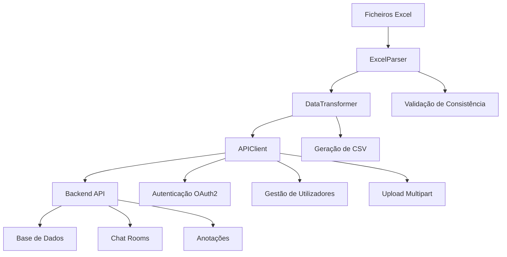

# Ferramentas de Conversão - Sistema de Anotação de Chat Rooms

## 📖 Visão Geral

Este conjunto de ferramentas de conversão constitui um **template funcional e sistema de interface** para importar dados de anotação em massa para o sistema de anotação de chat rooms. O sistema foi desenvolvido com o objectivo de criar um **workflow eficiente e reutilizável** que serve como modelo para futuras integrações de dados, demonstrando as melhores práticas para interacção com a API FastAPI do backend.

### Objectivos Estratégicos

1. **Interface API Eficiente**: Demonstrar como interagir de forma optimal com a API FastAPI desenvolvida, seguindo padrões de autenticação, gestão de dados e upload de ficheiros
2. **Workflow de Importação em Massa**: Estabelecer um processo standardizado para importar dados anotados existentes para o sistema
3. **Template de Desenvolvimento**: Fornecer um modelo técnico reutilizável para futuros workflows de importação de dados
4. **Automatização de Processos**: Minimizar intervenção manual através de detecção automática de ficheiros, validação de dados e gestão de erros

## 🏗️ Arquitectura do Sistema

### Estrutura de Ficheiros

```
conversion_tools/
├── import_excel.py                 # Script principal - interface de utilizador
├── config.yaml                     # Configuração do sistema (gerada automaticamente)
├── config.yaml.example            # Template de configuração
├── requirements.txt               # Dependências Python
├── excel_import/                  # Módulo principal de importação
│   ├── __init__.py               # Definições de exportação do módulo
│   ├── excel_parser.py           # Parser de ficheiros Excel - extracção de dados
│   ├── data_transformer.py      # Transformação de dados para formato API
│   ├── api_client.py            # Cliente API - interface com backend
│   └── batch_import_manager.py   # Gestor de importação em lote
└── README.md                     # Documentação técnica
```

### Componentes Técnicos

#### 1. **`import_excel.py`** - Interface Principal
**Responsabilidade**: Interface de utilizador e orchestração do workflow
- Detecção automática de ficheiros Excel em directórios padrão ou especificados via linha de comando
- Suporte para argumentos de linha de comando (`--folder`, `--verbose`) para personalização da execução
- Gestão de configuração (criação, validação, actualização)
- Interface interactiva para selecção de projectos
- Coordenação dos módulos de processamento
- Exibição de progressos e relatórios de importação

#### 2. **`excel_parser.py`** - Extractor de Dados Excel
**Responsabilidade**: Parsing e validação de ficheiros Excel multi-tab
- **Input**: Ficheiros `.xlsx` com múltiplos sheets (um por anotador)
- **Validação**: Verificação de colunas obrigatórias e consistência entre sheets
- **Extracção**: Dados de mensagens, anotações e metadados de anotadores
- **Padrões Suportados**: Detecção automática de nomes de anotadores em sheet names

```python
# Colunas obrigatórias esperadas
REQUIRED_COLUMNS = ["user_id", "turn_id", "turn_text", "reply_to_turn"]

# Padrões de detecção de colunas de thread/anotação
THREAD_COLUMN_PATTERNS = [
    r"^thread$", r"^thread_.*", r".*_thread.*",
    r"^annotation.*", r".*annotation.*"
]
```

#### 3. **`data_transformer.py`** - Transformador de Dados
**Responsabilidade**: Conversão de dados Excel para schemas compatíveis com a API
- **Transformação de Schemas**: Conversão para formato Pydantic compatível
- **Geração de Utilizadores**: Criação automática de contas de utilizador baseada em nomes de anotadores
- **Preparação CSV**: Conversão para formato CSV compatível com endpoints de import da API
- **Validação de Dados**: Verificação de integridade e consistência

```python
# Schemas de dados gerados
@dataclass
class ChatRoomCreate:
    name: str
    description: Optional[str] = None
    project_id: Optional[int] = None

@dataclass  
class ChatMessage:
    turn_id: str
    user_id: str
    turn_text: str
    reply_to_turn: Optional[str] = None

@dataclass
class AnnotationCreate:
    turn_id: str
    thread_id: str
```

#### 4. **`api_client.py`** - Cliente API
**Responsabilidade**: Interface completa com a API FastAPI do backend
- **Autenticação**: OAuth2 com gestão automática de tokens
- **Gestão de Utilizadores**: Criação e atribuição de utilizadores a projectos
- **Upload de Dados**: Import de mensagens e anotações via multipart form data
- **Gestão de Projectos**: Criação, listagem e validação de projectos

**Endpoints Utilizados**:
```python
# Autenticação
POST /auth/token

# Gestão de utilizadores (admin)
GET /admin/users
POST /admin/users

# Gestão de projectos (admin)
GET /admin/projects
POST /admin/projects
POST /projects/{project_id}/assign/{user_id}

# Import de dados (admin)
POST /admin/projects/{project_id}/import-chat-room-csv
POST /admin/chat-rooms/{chat_room_id}/import-annotations
```

#### 5. **`batch_import_manager.py`** - Gestor de Importação em Lote
**Responsabilidade**: Orquestração de importação de múltiplos ficheiros
- **Processamento em Lote**: Gestão de múltiplos ficheiros Excel
- **Gestão de Estado**: Tracking de progressos, erros e sucessos
- **Optimização**: Reutilização de conexões API e gestão eficiente de recursos
- **Relatórios**: Geração de relatórios detalhados de importação

## 🔄 Workflow de Importação

### Fluxo de Dados Completo



### Processo Detalhado

#### Fase 1: Preparação e Configuração
1. **Detecção de Ficheiros**: Scan automático de directórios padrão para ficheiros `.xlsx`
2. **Validação de Configuração**: Verificação/criação de `config.yaml`
3. **Teste de Conectividade**: Verificação de acesso à API backend
4. **Autenticação**: Login automático com credenciais de administrador

#### Fase 2: Análise de Dados
1. **Parsing Excel**: Extracção de dados de todos os sheets do ficheiro
2. **Detecção de Anotadores**: Identificação automática baseada em nomes de sheets
3. **Validação de Consistência**: Verificação de que todos os sheets têm as mesmas mensagens
4. **Validação de Schema**: Confirmação de colunas obrigatórias

#### Fase 3: Transformação de Dados
1. **Criação de Schemas**: Conversão para objectos compatíveis com a API
2. **Geração de Utilizadores**: Criação automática de contas de email baseadas em nomes
3. **Preparação CSV**: Formatação para upload via API
4. **Validação Final**: Verificação de integridade dos dados transformados

#### Fase 4: Importação para API
1. **Gestão de Projecto**: Seleção ou criação de projecto de destino
2. **Criação de Utilizadores**: Import de contas de anotadores via API
3. **Atribuição de Projecto**: Associação de utilizadores ao projecto
4. **Upload de Chat Room**: Criação de chat room com mensagens via CSV
5. **Upload de Anotações**: Import de anotações por utilizador via CSV

#### Fase 5: Verificação e Relatórios
1. **Validação de Import**: Verificação de dados importados
2. **Geração de Relatórios**: Estatísticas detalhadas de importação
3. **Logging**: Registo completo de operações e erros

## 📊 Formato de Dados Esperado

### Estrutura de Ficheiros Excel

Cada ficheiro Excel deve conter:
- **Múltiplos sheets**: Um sheet por anotador
- **Dados consistentes**: Todas as mensagens devem estar presentes em todos os sheets
- **Anotações individuais**: Cada sheet contém as anotações de um anotador específico

### Colunas Obrigatórias

```csv
user_id,turn_id,turn_text,reply_to_turn,thread
123,msg_001,"Hello everyone!",,"thread_1"
456,msg_002,"Hi there!",msg_001,"thread_1"
789,msg_003,"How's it going?",,"thread_2"
```

**Descrição das Colunas**:
- `user_id`: Identificador do utilizador que enviou a mensagem
- `turn_id`: Identificador único da mensagem/turno
- `turn_text`: Conteúdo textual da mensagem
- `reply_to_turn`: ID da mensagem à qual esta responde (opcional)
- `thread`/`thread_id`: Identificador do thread de anotação

## 🧪 Workflow de Testing com Dados Reais (Raw Annotated Data)

### Objectivo: Testar a aplicação com dados anotados reais

Este workflow permite testar todas as funcionalidades da aplicação usando ficheiros Excel que contêm **dados já anotados** por múltiplos anotadores, simulando um cenário real de investigação.

#### 1. Preparar Dados de Teste (Raw Annotated Data)

**Localização dos ficheiros**:
```bash
# Colocar ficheiros .xlsx em qualquer destas pastas:
uploads/Archive/          # Pasta preferencial para dados de teste
uploads/                  # Pasta alternativa
conversion_tools/excel_files/  # Para testing directo
```

**Estrutura esperada dos ficheiros**:
```
chat_anotado_exemplo.xlsx
├── thread_joao      # Anotações completas do João
├── thread_maria     # Anotações completas da Maria  
├── annotation_pedro # Anotações completas do Pedro
└── anotacao_ana     # Anotações completas da Ana
```

#### 2. Setup das Conversion Tools

```bash
# Instalar dependências
cd conversion_tools
pip install -r requirements.txt

# Configurar API (simplificado para testing)
cp config.yaml.example config.yaml
```

**Configuração para testing (`config.yaml`)**:
```yaml
api:
  base_url: "http://localhost:8000"  # Ou IP do servidor
  admin_email: "admin@example.com"
  admin_password: "admin"

import:
  email_domain: "research.pt"
  default_user_password: "password"  # Password simplificada para testing
  auto_confirm: false  # Para verificar dados antes de importar
```

#### 3. Executar Importação de Dados Reais

É possível executar o script para que procure ficheiros nas pastas padrão ou especificar uma pasta directamente.

```bash
# Executar o script para procurar ficheiros em pastas padrão
python import_excel.py

# Ou, de forma mais directa, apontar para a pasta com os dados de teste
python import_excel.py --folder ../uploads/Archive
```

**O que acontece automaticamente**:
1. **Detecção** de ficheiros Excel nas pastas
2. **Preview** dos dados (quantos anotadores, mensagens, anotações)
3. **Seleção** de projeto (criar novo ou usar existente)
4. **Importação completa**:
   - Criação de utilizadores com emails limpos: `joao@research.pt`, `maria@research.pt`
   - Passwords simples: `password`
   - Importação de mensagens e anotações de cada anotador
   - Associação ao projeto selecionado

#### 4. Verificar Importação na Aplicação

**Login como administrador**:
- URL: http://localhost:3721 (ou IP do servidor)
- Email: `admin@example.com`
- Password: `admin`

**Verificações**:
- ✅ Projeto criado/selecionado
- ✅ Chat rooms importados com nomes descritivos
- ✅ Utilizadores criados automaticamente
- ✅ Mensagens importadas correctamente
- ✅ Anotações associadas a cada utilizador

**Login como anotador** (dados importados):
- Email: `joao@research.pt` / Password: `password`
- Email: `maria@research.pt` / Password: `password`
- Email: `pedro@research.pt` / Password: `password`

#### 5. Testar Funcionalidades com Dados Reais

**Interface de Anotação**:
- Navegar pelas mensagens importadas
- Ver anotações existentes (threads identificados)
- Testar sistema de tags
- Verificar navegação entre mensagens

**Métricas de IAA (Inter-Annotator Agreement)**:
- Aceder secção de análise
- Ver métricas calculadas automaticamente entre anotadores
- Verificar consistency entre anotações
- Examinar relatórios de agreement

**Dashboard Administrativo**:
- Ver estatísticas do projeto
- Progresso dos anotadores
- Distribuição de anotações
- Métricas de qualidade

#### 6. Resultados do Testing

**Dados disponíveis após importação**:
- **Chat rooms** com conversas reais anotadas
- **Múltiplos anotadores** com different perspectives
- **Métricas IAA** calculáveis automaticamente
- **Interface funcional** com dados realísticos

**Benefícios do testing com dados reais**:
- Validação completa do workflow
- Testing de performance com dados realísticos  
- Verificação de métricas IAA com dados diversos
- Identificação de edge cases reais
- Demonstração de funcionalidades completas

### Exemplo de Output da Importação

```
📊 IMPORT RESULTS SUMMARY
=========================

📁 Files processed: 2
✅ Successful imports: 2
❌ Failed imports: 0
⏱️  Total time: 32.1 seconds

📋 PROJECT: "Estudo Chat Disentanglement 2025"
  └── Chat rooms created: 2
  └── Users created: 6
  └── Total messages: 150
  └── Total annotations: 450

📊 DETAILED RESULTS
===================

✅ chat_estudo_principal.xlsx
   Chat room ID: 12
   Chat room: "Estudo Principal - Multi-Annotator Study (4 annotators)"
   Users created: 4 (joao@research.pt, maria@research.pt, pedro@research.pt, ana@research.pt)
   Messages: 100
   Annotations: 320
   Annotators: joao, maria, pedro, ana

✅ chat_piloto.xlsx
   Chat room ID: 13
   Chat room: "Piloto - Multi-Annotator Study (2 annotators)"
   Users created: 2 (bruno@research.pt, carla@research.pt)
   Messages: 50
   Annotations: 130
   Annotators: bruno, carla

🎯 READY FOR TESTING:
- Login admin: admin@example.com / admin
- Login anotadores: [nome]@research.pt / password
- URL: http://localhost:3721
- Métricas IAA disponíveis para análise
```

### Vantagens dos Dados Reais para Testing

1. **Validação Completa**: Testa todo o pipeline com dados realísticos
2. **Métricas Verdadeiras**: IAA calculations com variabilidade real entre anotadores
3. **Edge Cases**: Identifica problemas com dados reais (mensagens longas, caracteres especiais, etc.)
4. **Performance**: Testa performance com quantidades realísticas de dados
5. **User Experience**: Permite avaliar UX com dados reais em vez de dados dummy
6. **Demo Ready**: Sistema fica pronto para demonstrações com dados convincentes

### Padrões de Nomes de Sheets

O sistema detecta automaticamente nomes de anotadores usando padrões regex:
```python
ANNOTATOR_PATTERNS = [
    r"thread_(.+)",           # "thread_joao" → "joao"
    r"(.+)_annotations",      # "joao_annotations" → "joao"  
    r"(.+)_thread",          # "joao_thread" → "joao"
    r"annotation_(.+)",       # "annotation_joao" → "joao"
    r"anotação (.+)",        # "anotação João" → "João"
    r"^(.+)$"                # fallback: nome completo
]
```

## ⚙️ Configuração Técnica

### Ficheiro `config.yaml`

```yaml
api:
  base_url: "http://localhost:8000"
  admin_email: "admin@example.com"
  admin_password: "admin"

project:
  mode: "select_existing"  # create_new, select_existing, use_id
  project_id: 1
  new_project:
    name: "Excel Import Project"
    description: "Project created from Excel import tool"
  last_used_project_id: null

import:
  email_domain: "research.pt"
  default_user_password: "ChangeMe123!"
  auto_confirm: false

logging:
  level: "INFO"
  file: null

output:
  save_report: true
  report_file: "import_report_{timestamp}.txt"
```

### Variáveis de Ambiente

O sistema suporta configuração via variáveis de ambiente para ambientes de produção:
```bash
export API_BASE_URL="https://api.production.com"
export API_ADMIN_EMAIL="admin@company.com"
export API_ADMIN_PASSWORD="secure_password"
```

## 🚀 Utilização

### Instalação e Setup

```bash
# 1. Activar ambiente virtual
cd conversion_tools
source venv/bin/activate

# 2. Instalar dependências
pip install -r requirements.txt

# 3. Colocar ficheiros Excel em directórios suportados
# ../uploads/Archive/ (recomendado)
# ../uploads/
# ./excel_files/
# ./

# 4. Executar ferramenta
python import_excel.py

# Para importar de uma pasta específica, use o argumento --folder:
python import_excel.py --folder ../uploads/Archive

# Para obter logs detalhados (debugging), use o argumento --verbose:
python import_excel.py --verbose
```

### Workflow Interactivo

O script guia o utilizador através de um processo interactivo:

1. **Primeira Execução**: Criação automática de configuração
2. **Detecção de Ficheiros**: Lista automática de ficheiros Excel encontrados
3. **Seleção de Projecto**: Interface para escolha/criação de projecto
4. **Preview de Dados**: Exibição detalhada do que será importado
5. **Confirmação**: Verificação final antes da importação
6. **Execução**: Processamento com barras de progresso
7. **Relatório**: Resumo detalhado dos resultados

### Exemplo de Output

```
🚀 Ferramenta de Importação Excel - Sistema de Anotação
═══════════════════════════════════════════════════════

📁 Found 3 Excel files in ../uploads/Archive/
   • AMO_R01.xlsx
   • AMO_R02.xlsx  
   • VAC_R10.xlsx

🔑 Autenticating with API...
✅ Successfully authenticated as admin@example.com

📋 Project Selection:
   1. Chat Disentanglement Study (ID: 1)
   2. Annotation Quality Research (ID: 2)
   3. Create new project
   
Select project [1]: 1

📊 Import Preview:
═══════════════════
Files to process: 3
Total annotators: 12
Total messages: 1,847
Total annotations: 8,234

Continue with import? [y/N]: y

🔄 Processing AMO_R01.xlsx...
   📖 Parsing Excel file...
   👥 Creating users: joao@research.pt, pedro@research.pt...
   🏠 Creating chat room: AMO_R01 - Multi-Annotator Study
   📤 Uploading messages (160 messages)...
   🏷️ Importing annotations for joao@research.pt (234 annotations)...
   ✅ Completed in 12.3s

✅ Import completed successfully!
📈 Final Report: 3 files, 12 users, 3 chat rooms, 8,234 annotations
```

## 🔧 Desenvolvimento e Extensão

### Patterns de Design Implementados

1. **Separation of Concerns**: Cada módulo tem uma responsabilidade específica
2. **Dependency Injection**: Configuração injectada via parâmetros
3. **Error Handling**: Gestão robusta de erros com logging detalhado
4. **Progress Tracking**: Feedback em tempo real para operações longas
5. **Batch Processing**: Optimização para processamento de múltiplos ficheiros

### Extensibilidade

O sistema foi desenvolvido como template para futuros workflows:

```python
# Exemplo de extensão para novos formatos de dados
class CSVImportManager(BatchImportManager):
    def process_single_file(self, file_path: str) -> ImportResult:
        # Implementar parsing específico para CSV
        pass

# Exemplo de novo transformer
class CustomDataTransformer(DataTransformer):
    def custom_format_to_api_schema(self, data):
        # Implementar transformação customizada
        pass
```

### Testing e Debugging

```bash
# Activar logging detalhado para debugging
python import_excel.py --verbose

# Processar ficheiros de uma pasta específica para testing
python import_excel.py --folder ../uploads/Archive --verbose
```

## 🛡️ Compliance com API Backend

### Verificação de Conformidade

O sistema foi auditado para compliance 100% com a API FastAPI:

- ✅ **Autenticação OAuth2**: Form data com `application/x-www-form-urlencoded`
- ✅ **Gestão de Headers**: Limpeza correcta de headers para uploads multipart
- ✅ **Schemas de Dados**: Conformidade total com schemas Pydantic do backend
- ✅ **Formato CSV**: Colunas e delimitadores conforme esperado pela API
- ✅ **Gestão de Erros**: Handling apropriado de códigos de status HTTP
- ✅ **Upload de Ficheiros**: Multipart form data correctamente formatado

### Endpoints API Utilizados

Todos os endpoints são utilizados conforme especificação OpenAPI:

```python
# Conformidade verificada para cada endpoint
auth_endpoints = [
    "POST /auth/token"  # OAuth2PasswordRequestForm
]

admin_endpoints = [
    "GET /admin/users",                                    # List users
    "POST /admin/users",                                   # Create user  
    "GET /admin/projects",                                 # List projects
    "POST /admin/projects",                                # Create project
    "POST /admin/projects/{id}/import-chat-room-csv",      # Import messages
    "POST /admin/chat-rooms/{id}/import-annotations"       # Import annotations
]

project_endpoints = [
    "POST /projects/{project_id}/assign/{user_id}"        # Assign user to project
]
```

## 📚 Casos de Uso e Aplicações

### 1. Importação de Dados Históricos
Migração de anotações existentes de outros sistemas ou formatos para o sistema actual.

### 2. Integração de Ferramentas Externas
Template para conectar ferramentas de anotação externas (LabelStudio, Prodigy, etc.) ao sistema.

### 3. Workflows de Investigação
Importação rápida de dados anotados por investigadores para análise comparativa.

### 4. Backup e Restauro
Exportação/importação para backup de dados de anotação.

### 5. Template de Desenvolvimento
Base para desenvolvimento de novos conectores e workflows de importação.

## 🔍 Troubleshooting Técnico

### Problemas Comuns

1. **Erro de Conexão API**
   ```
   APIError: Cannot connect to API at http://localhost:8000
   ```
   **Solução**: Verificar se o backend está em execução e acessível

2. **Erro de Autenticação**
   ```
   APIError: Authentication failed: 401 Unauthorized
   ```
   **Solução**: Verificar credenciais no `config.yaml`

3. **Erro de Formato Excel**
   ```
   ValueError: Missing required columns: ['turn_id', 'turn_text']
   ```
   **Solução**: Verificar estrutura do ficheiro Excel conforme especificação

4. **Erro de Upload**
   ```
   APIError: Failed to create chat room and import messages
   ```
   **Solução**: Verificar logs detalhados e formato de dados CSV gerado

### Debug Avançado

```python
# Activar logging debug
import logging
logging.basicConfig(level=logging.DEBUG)

# Verificar dados transformados antes do upload
transformer = DataTransformer()
csv_data = transformer.prepare_csv_import_data(messages)
print("CSV Data:", csv_data[:500])  # Primeiro 500 caracteres
```

## 🎯 Conclusão

Este sistema de ferramentas de conversão representa uma implementação completa e robusta para integração eficiente com APIs FastAPI, fornecendo um modelo técnico sólido para futuros desenvolvimentos de workflows de importação de dados. A arquitectura modular, compliance total com a API, e extensibilidade fazem desta solução um template valioso para qualquer sistema que necessite de importação de dados estruturados em massa.

O sistema demonstra as melhores práticas em:
- **Interface com APIs REST/FastAPI**
- **Gestão de autenticação OAuth2**
- **Upload de ficheiros multipart**
- **Processamento de dados em lote**
- **Gestão de erros robusta**
- **User experience interactiva**